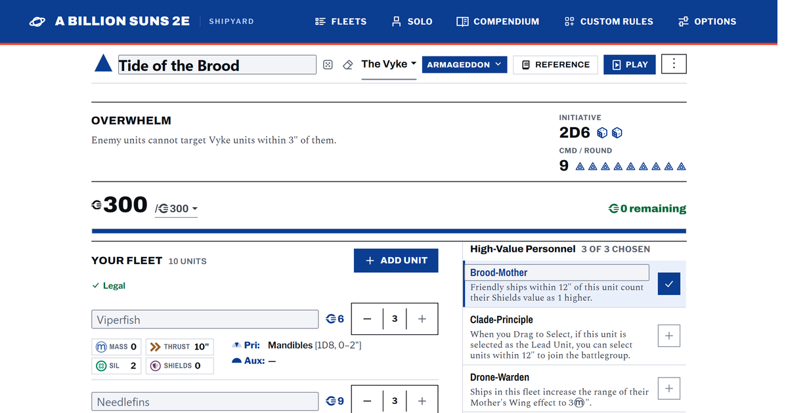

<div align="center">

[](https://type37.github.io/a-billion-suns-shipyard/)

# A Billion Suns 2e Shipyard

### [Open it](https://type37.github.io/a-billion-suns-shipyard/)

</div>

Assemble and print your fleet in this unofficial fleet builder for [A Billion Suns](https://planetsmashergames.com/a-billion-suns/), published by Osprey Games. This web app was designed by WarLore.

## What it does

- Three eras, twelve factions, and a Foundry for your own.
- Live validation, printable roster, share links, fleet sync.
- Play mode, and Junkspace solo as a campaign rather than a screen.
- Ship compendium, Learn to Play, quick-reference PDF.
- Rules text verbatim from the book, never paraphrased.

## Design decisions

- Dresses as its own rulebook: white paper, near-black ink, corporate amber, the ABS delta.
- Each era gets the screen it needs. Hypergrowth builds a Shipyard in one column; the other two build a Fleet List in two.
- One renderer for print preview and paper. Two would break in different places and the page count would lie.
- No framework. One store, one `render()`, and a rules engine in `src/` that never touches the DOM so it can be tested alone.
- No "Download PDF" button. It needs a PDF library, and one that just called `window.print()` would be a lie.

## Still to do

- Solo mode is unfinished. The missing piece is a moddable Blip table for enemy encounters, not a fleet you assemble.
- Play mode has no per-ship damage. Filtering commands by phase was tried and dropped: CMD is one free pool and reactive commands are spent in the opponent's turn, so it hid legal plays.
- 88 of 153 library emblems sit loose in the root and land in the catch-all "General" folder.
- The `chief-engineer` HVP id collides between The Unity and the generic list. Left alone: renaming an id changes what saved fleets carry.

## Run it

Vite and TypeScript, no backend. Node 18+.

```bash
npm install && npm run dev
```

`npm run typecheck && npm test` before pushing. Pages serves from `gh-pages`, which only moves when a build is published — see [HANDOFF.md](HANDOFF.md).

## Legal

A Billion Suns is by Mike Hutchinson, published by Osprey Games. Unofficial, not affiliated with Osprey.

[Get the rulebook](https://planetsmashergames.com/a-billion-suns/) · [Report a bug](https://github.com/Type37/a-billion-suns-shipyard/issues/new/choose) · [WarLore](https://linktr.ee/warlore)
