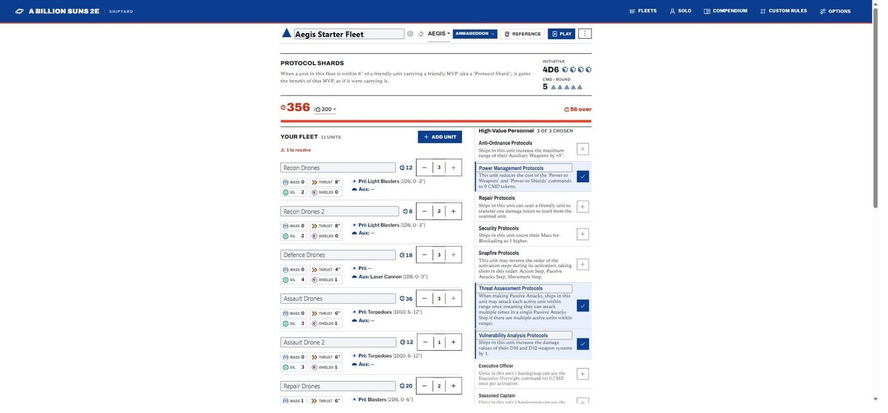
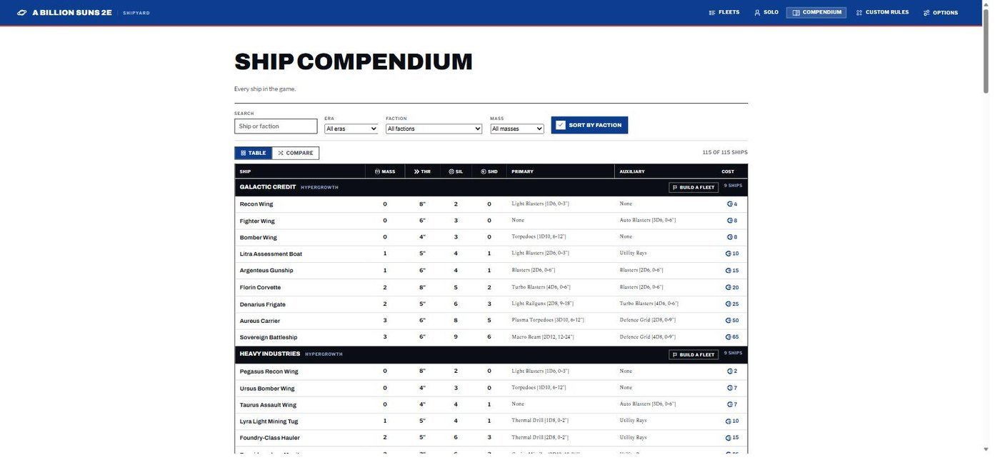
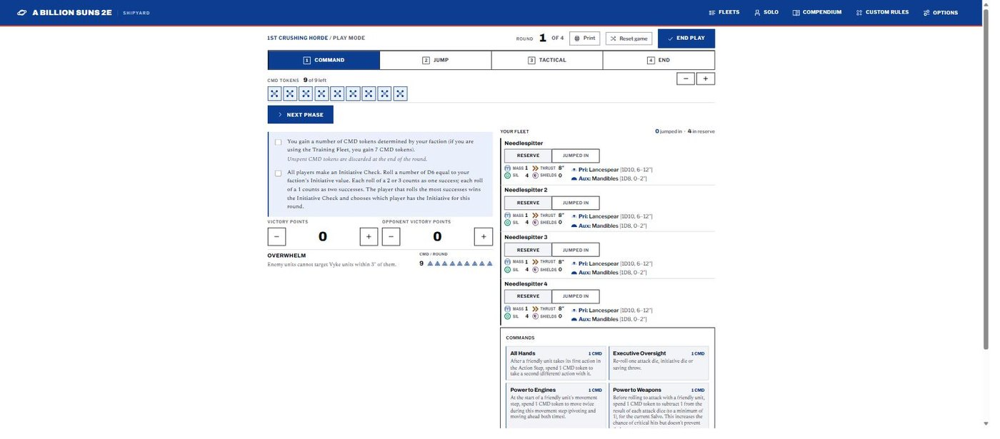

# A Billion Suns 2e Shipyard

A fleet builder for **A Billion Suns, 2nd Edition** (Mike Hutchinson / Osprey Games).

**Live:** https://type37.github.io/a-billion-suns-shipyard/

Pick an era and a faction, build a legal Fleet List or stock a Shipyard, give it
an emblem, then play from it, print it or share it.


## What's in it

- Three eras: Armageddon, Age of Unity, Hypergrowth
- Twelve factions, and a Foundry for your own
- Rules validation
- Play Mode
- Printable roster
- Share links
- Fleet Sync
- Learn to Play, and the Rules
- Solo play: Junkspace
- Ship Compendium
- Quick Reference PDF

## The tour

### The list, live



Three hundred credits of Aegis, and fifty-six over the line in red before you
have finished naming it. Costs total as you tap the steppers, the era sets the
budget, and the High-Value Personnel column keeps its own count — three of three
chosen, with the picked ones outlined. Nothing important hides behind a drill-in:
every ship's Mass, Thrust, Silhouette, Shields and both weapon systems are on the
page at once, because that is what you are actually comparing when you decide
whether the Assault Drones stay.

### Every hull in the game



All 115 ships across twelve factions, filtered by era, faction and mass, or
thrown into one flat table when the question is "what is the cheapest Mass 2
thing with a torpedo". Each faction block has a Build a Fleet button on it, so
browsing turns into building without a trip back to the menu. Compare mode puts
any set of hulls side by side.

### At the table



Four phases, four rounds, and a CMD pool you spend by tapping tokens off it. The
fleet runs down the right with a Reserve / Jumped In switch on every unit, so the
tracker knows what is still in your Reserves area and what is out there getting
shot at. The Commands sit at the bottom of the same screen because that is where
your thumb goes mid-turn, and your faction's rule — Overwhelm, here — sits under
the phase checklist rather than in a book on the other side of the table.

### The book, verbatim


Learn to Play and the Rules quote the rulebook word for word: Cost, Mass, Thrust,
Silhouette, Shields and Weapons, each beside the icon the builder prints against
that number, so the mark means the same thing in both places. The four phase
pages get the same treatment, with animated vector diagrams for the geometry a
sentence cannot draw — a 6" deployment bubble, a 180° auxiliary arc, a battlegroup
being dragged out to a Combined Mass of 10.

## Layout

```
src/            Rules engine. Framework-free, tested, no DOM.
  types.ts        Domain model
  validation.ts   validateFleet() — the list-building rules
  data/           Faction rosters, HVP, training fleets, solo content
test/           node --test suites for the engine

web/            The browser app (Vite root). One store, one render(),
                no framework — see HANDOFF.md before changing it.
```

## Deploying

Pushing `main` does **not** update the live site. GitHub Pages serves from the
**`gh-pages`** branch and only moves when a build is published:

```bash
npm run build
cd dist
touch .nojekyll
git init && git checkout -b gh-pages
git add -A && git commit -m "Deploy"
git push -f https://github.com/Type37/a-billion-suns-shipyard.git gh-pages
rm -rf .git
```

`base: "./"` in `vite.config.ts` keeps asset paths relative so the site works
from the Pages subpath. The CDN can take a few minutes to flip.

## Contributing

[HANDOFF.md](HANDOFF.md) is the working document: architecture, the house rules
about naming and verbatim rules text, and what has recently changed.

---

*A Billion Suns is © Mike Hutchinson, published by Osprey Games. This is an
unofficial fan-made tool. Shipyard by [WarLore](https://linktr.ee/warlore).*
